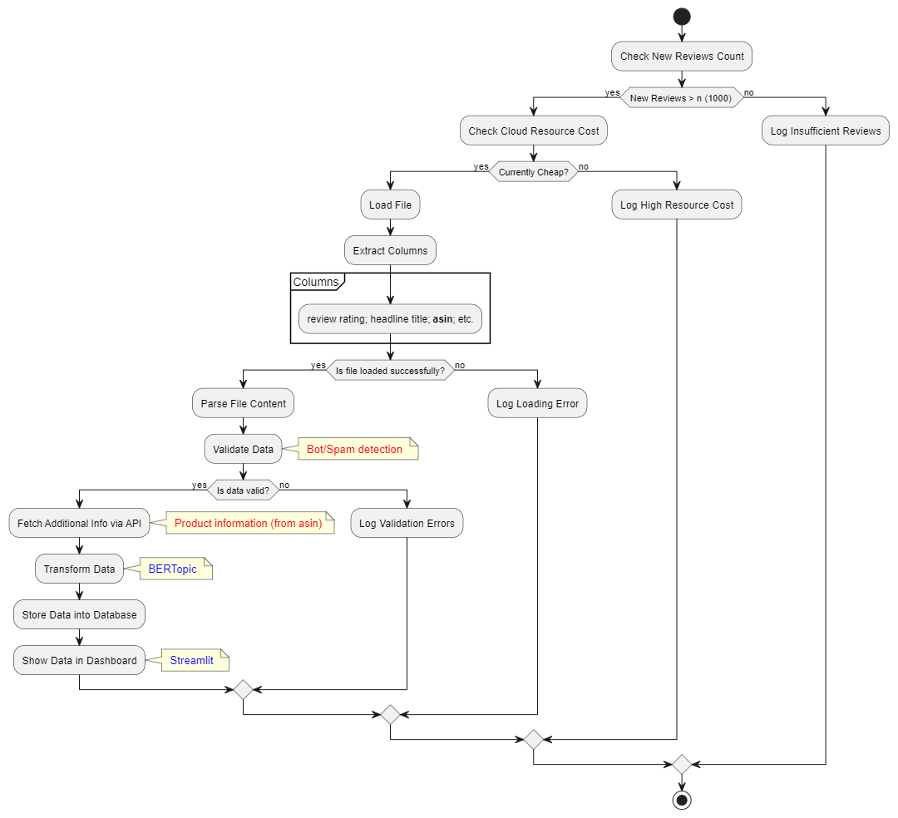

# AmzReviewTrendsPOC

<a target="_blank" href="https://cookiecutter-data-science.drivendata.org/">
    
</a>

This project is a proof of concept (POC) aimed at discovering and analyzing trending topics in Amazon customer reviews for health and personal care products. 


The dataset ist sequential sample of product reviews and allows for a wide set of insights. It contains 494121 reviews from 05 February 2001 to 11 September 2023. Without any text processing groups an unsupervised text modeling algorithm (BERT) the reviews in more than 3000 topic. Additionally, each reviews contains a Amazon Standard Identification Number (ASIN) which can be used to fetch various details about a product, including the product title, release date, manufacturer, price, customer reviews, and product specifications.


## Problem Clarification & Data Requirements
Given the amount and dimensionality of the data , I break down stakeholders into specific and develop metrics to individual decision making. Next, I process the data with these metrics in mind.

Let's consider two cases for this POC:
    - Management: What are the five most discussed topics among the 200 most reviewed products?
    - Product Owner: How does the forecast of a review lifecycle look after a product is launched?


The goal is role skema is to tailer the insights of the analysis to the real needs of stakeholders. This focus helps to ensures the overall quality of the product and allocate resources in a efficient way.

Deployed to production, the Analysis of this POC would be a batch process that is executed once a reasonable amount of news reviews (e.g. 1000) are published and the cureent cloud computing costs are low. The flow diagrams of this process  could look like this:




## Data collection & exploration
The code for this step is stored in the `AmzReviewTrendsPOC\data\load_and_clean_hist_reviews.py` directory. This script

- Unzips and load the file.
- Convert the timestemp into pandas datetime variables.
- Define the timzone ( UTC -7, as the data was parsed at UCSD)
- Removes specific unwanted patterns (such as 'br', 'itbr', 'prosbr', etc.) that mess up the topic modelling.


Overall the data looks pretty good. Very little nans, consistency between ratings make sense.


We can fetch additional information about each product, via the **asin** from  external sources.
There is an wrapper library to fetch product data via and API, but get a key of this serive one needs and active member ship Amazon Associates Programm, which requires steps that are beyond the scope of this POC. For now, we just scrape for some popular products the Release Date and the publishing year. 
The scrapper was build with selenium and is stored in  `AmzReviewTrendsPOC\data\get_product_info.py` 


## Feature Engineering

To provide insights to the stakeholder roles in this POC, we need the follow features:

- Text (to model topics)
- Release data (from the assin)

## Model Development

This POC leverages the Python library [BERTopic](https://pypi.org/project/bertopic/) to identify and analyze topics in Amazon reviews. BERTopic is used not only to classify review topics but also for dynamic topic modeling, allowing us to examine how certain products are reviewed over time.

In the current setup,the model follow  default settingss. I Vectorize the text, remove english stopwords and use the unsupervided BERTtopic algorithms to identify topics. 


The largest topic in these documents is an outlier without a common theme. Relabel reviews in this group with their nearest topic using specified strategies to ensure all documents are associated with a relevant topic.


I save the model locally with `.safetensors` 


## Deployment, Monitoring & Integration

To demonstrate the insight the current project can provide, do we use a simple dashboard with [Streamlit](https://streamlit.io/) that show for each stakeholder the relevant metrics that help to make decisions. 

For now, I deploy the streamlit app simply on a local machine. 

## Project Organization

```
├── LICENSE            <- Open-source license if one is chosen
├── Makefile           <- Makefile with convenience commands like `make data` or `make train`
├── README.md          <- The top-level README for developers using this project.
├── data
│   ├── external       <- Data from third party sources.
│   ├── interim        <- Intermediate data that has been transformed.
│   ├── processed      <- The final, canonical data sets for modeling.
│   └── raw            <- The original, immutable data dump.
│
├── docs               <- A default mkdocs project; see mkdocs.org for details
│
├── models             <- Trained and serialized models, model predictions, or model summaries
│
├── notebooks          <- Jupyter notebooks. Naming convention is a number (for ordering),
│                         the creator's initials, and a short `-` delimited description, e.g.
│                         `1.0-jqp-initial-data-exploration`.
│
├── pyproject.toml     <- Project configuration file with package metadata for AmzReviewTrendsPOC
│                         and configuration for tools like black
│
├── references         <- Data dictionaries, manuals, and all other explanatory materials.
│
├── reports            <- Generated analysis as HTML, PDF, LaTeX, etc.
│   └── figures        <- Generated graphics and figures to be used in reporting
│
├── requirements.txt   <- The requirements file for reproducing the analysis environment, e.g.
│                         generated with `pip freeze > requirements.txt`
│
├── setup.cfg          <- Configuration file for flake8
│
└── AmzReviewTrendsPOC                <- Source code for use in this project.
    │
    ├── __init__.py    <- Makes AmzReviewTrendsPOC a Python module
    │
    ├── data           <- Scripts to download or generate data
    │   └── make_dataset.py
    │
    ├── features       <- Scripts to turn raw data into features for modeling
    │   └── build_features.py
    │
    ├── models         <- Scripts to train models and then use trained models to make
    │   │                 predictions
    │   ├── predict_model.py
    │   └── train_model.py
    │
    └── visualization  <- Scripts to create exploratory and results oriented visualizations
        └── visualize.py
```

