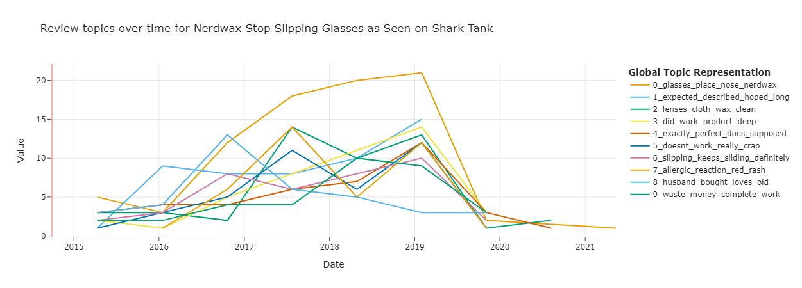

# AmzReviewTrendsPOC

<a target="_blank" href="https://cookiecutter-data-science.drivendata.org/">
    
</a>

This project is a proof of concept (POC) aimed at discovering and analyzing trending topics in Amazon customer reviews for health and personal care products.

The dataset is a sequential sample of product reviews and allows for a wide set of insights. It contains 494,121 reviews from 05 February 2001 to 11 September 2023. Using an unsupervised text modeling algorithm (BERT) without any text processing groups, the reviews are categorized into more than 3000 topics. Additionally, each review contains an Amazon Standard Identification Number (ASIN), which can be used to fetch various details about a product, including the product title, release date, manufacturer, price, customer reviews, and product specifications.

## Problem Clarification & Data Requirements

Given the amount and dimensionality of the data, I break down stakeholders into specific groups and develop metrics for individual decision making. Next, I process the data with these metrics in mind.

Let's consider the case of a Product Owner for this POC. They:
- Need to know what people do and do not like about a specific product.
- Are interested in the product lifecycle since release.
- Relevant metrics are, for instance:
  - Time between product release and reviews.
  - How the review sentiment changes over time.

The goal is to tailor the insights of the analysis to the real needs of stakeholders. This focus helps to ensure the overall quality of the product and allocate resources efficiently.

### Pipeline Structure

The flow diagram outlines how this analysis could be deployed to production as a batch process that is executed once a reasonable number of new reviews (e.g., 1000) are published and the current cloud computing costs are low. This POC illustrates the core features of the project.


## Data Collection & Exploration

The code for this step is stored in the `AmzReviewTrendsPOC/data/load_and_clean_hist_reviews.py` directory. This script:
- Unzips and loads the file.
- Converts the timestamp into pandas datetime variables.
- Defines the timezone (UTC -7, as the data was parsed at UCSD).
- Removes specific unwanted patterns (such as 'br', 'itbr', 'prosbr', etc.) that mess up the topic modeling.

Overall, the data looks pretty good. Very few NaNs, and consistency between ratings makes sense.

We can fetch additional information about each product via the **ASIN** from external sources. There is a wrapper library to fetch product data via an API, but to get a key for this service, one needs an active membership in the Amazon Associates Program, which requires steps that are beyond the scope of this POC. For now, we just scrape for some popular products' Release Date and the publishing year.
The scraper was built with Selenium and is stored in `AmzReviewTrendsPOC/data/get_product_info.py`.


## Feature Engineering

To provide insights to the stakeholder roles in this POC, we need the following features:

- Text (to model topics)
- Release data (from the ASIN)

## Model Development

This POC leverages the Python library [BERTopic](https://pypi.org/project/bertopic/) to identify and analyze topics in Amazon reviews. BERTopic is used not only to classify review topics but also for dynamic topic modeling, allowing us to examine how certain products are reviewed over time.

In the current setup, the model follows default settings. I vectorize the text, remove English stopwords, and use the unsupervised BERTopic algorithm to identify topics.

The largest topic in these documents is an outlier without a common theme. I relabel reviews in this group with their nearest topic using specified strategies to ensure all documents are associated with a relevant topic.

I save the model locally with `.safetensors`.

## Dashboard

Here is a screenshot from the dashboard that provides insights to a Product Owner.

Apparently, this product appeared on the TV show "Shark Tank". It took around 6 months between the product release and the first reviews. The overall sentiment is mixed, as the current sample includes all types of reviews. Based on popular topics, critiques on the product include:
- Being slippery
- Allergic reactions



## Next Steps: Deployment, Monitoring & Integration

The current POC uses a simple [Streamlit](https://streamlit.io/) app to show each stakeholder the relevant metrics that help make decisions. To improve this concept further, one could:
- Add monitoring features to the dashboard, tailored to the needs of each stakeholder.
- Improve default representation of the topics (with BERTopic and OpenAI).
- Write an API for this analysis, so that it can be called from a backend.
- Forecast trends with Prophet.

For now, I deploy the Streamlit app simply on a local machine.


## Project Organization

```
├── LICENSE            <- Open-source license if one is chosen
├── Makefile           <- Makefile with convenience commands like `make data` or `make train`
├── README.md          <- The top-level README for developers using this project.
├── data
│   ├── external       <- Data from third party sources.
│   ├── interim        <- Intermediate data that has been transformed.
│   ├── processed      <- The final, canonical data sets for modeling.
│   └── raw            <- The original, immutable data dump.
│
├── docs               <- A default mkdocs project; see mkdocs.org for details
│
├── models             <- Trained and serialized models, model predictions, or model summaries
│
├── notebooks          <- Jupyter notebooks. Naming convention is a number (for ordering),
│                         the creator's initials, and a short `-` delimited description, e.g.
│                         `1.0-jqp-initial-data-exploration`.
│
├── pyproject.toml     <- Project configuration file with package metadata for AmzReviewTrendsPOC
│                         and configuration for tools like black
│
├── references         <- Data dictionaries, manuals, and all other explanatory materials.
│
├── reports            <- Generated analysis as HTML, PDF, LaTeX, etc.
│   └── figures        <- Generated graphics and figures to be used in reporting
│
├── requirements.txt   <- The requirements file for reproducing the analysis environment, e.g.
│                         generated with `pip freeze > requirements.txt`
│
├── setup.cfg          <- Configuration file for flake8
│
└── AmzReviewTrendsPOC                <- Source code for use in this project.
    │
    ├── __init__.py    <- Makes AmzReviewTrendsPOC a Python module
    │
    ├── data           <- Scripts to download or generate data
    │   └── make_dataset.py
    │
    ├── features       <- Scripts to turn raw data into features for modeling
    │   └── build_features.py
    │
    ├── models         <- Scripts to train models and then use trained models to make
    │   │                 predictions
    │   ├── predict_model.py
    │   └── train_model.py
    │
    └── visualization  <- Scripts to create exploratory and results oriented visualizations
        └── visualize.py
```
