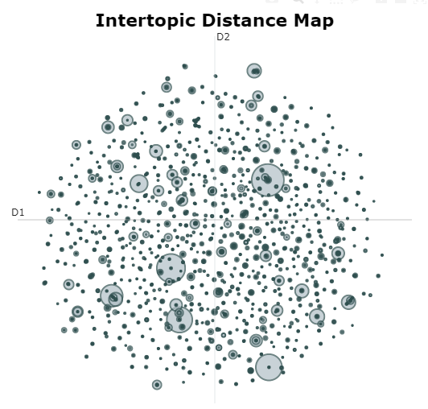

<!-- _class: title -->

# Generative AI 

 
<!-- _class: subtitle -->

## Case Interview for ADC

July 22nd  2024

Felix Schilling, PhD

---
# This presentation 

- Amazon Review Trends  POC (20 min)
  - Goal of the Project
  - Project plan
  - POC 
-  Retrievel-Augmented Generation (RAG) (10 min)

---
# The Goal

Provide **useful insights** from customer feedback to stakeholders in the health and personal care sector. 

---

#  Project plan

- Workshop w. Stakeholder 
- POC pipeline 
  - Batch process, API, cleaning
  - Model Development  & Deployment
  - Visualization and Reporting

- Dashboards for specific stakeholders (accessible)
- Improve POC based on stakeholder (feedback loop).

---

# The big picture I: 
 
 - Overall good quality of the reviews. 
 - Bots/Spam seems to be filtered out.

 - **Assumption:** Reviews are "honest" 
    - We can implement what they say to improve products.
    - We can test this assumption with the POC.

---
# The big picture II: 
## Topics & Trends are to complex to discuss them as a whole.  

  1) Text dimension (structured and unstructured): > 3000 Topics with BERT
  2) Time dimension: >22 years
  3) ASIN codes: >60k unique product

**Let's focus on  micro level cases for specific stakeholders.**

---
# Initial Stakeholder Consultation

Let's define role, needs and metrics of our stakeholders.

**Q: What's the challenge and metric defines the solution?**

---
# Stakeholder Roles Examples

1. Product Owner
    - Needs to know what people do and do not like about a specific product.
    - Interested in the product lifecycle since release.
    - Metrics:
      - Time between product release and reviews.
      - How the review sentiment changes over time.

2. Marketing Strategist
    - Interested in products that work via indirect consumer marketing.
    - Focuses on purchase decisions made within a household or close relationship.
    - Metric: Product reviews that mention family members.
    - Example: A spouse or partner buys your shower gel.

---

#  Pipeline (Batch Processing, API Call & NLP)

---

# Model Development

BERTtopic.
- Find topics and trends with an unsupdervised Algorithm.
- AI (ChatGPT) to label Topic themes.

Link to ASIN and Time variables before hand.
 - Select only the **relevant** reviews for each task.
 - Increases accuracy and reduces runtime.

---

# Dashboard

Accessible "micro insights" for each stakeholder.

- How do the metrics that matter for my task look like?
- How do my actions relate this ?

(Screenshot of the streamlit Dashboard)

---

# Timeline / Phases

- Initial Meeting
- POC presentation for low level stakeholders
- Revision POC based on stakeholder feedback
- Presentation to a larger audience. 

---

# RAG: Retrieval-Augmented Generation

---

# The goal 

 - Feeding  LLMs domain specific knowledge
  -  Better answers
  -  References
  -  Publishing date of reference /information

---
# Main challange

  1) Performance.
  2) Getting the right data.
  3) Knowing what its (still) the right data.

---

# Hypothesis 
- Best Practices & existing tech stack to minimize the uptake in tech burden.

- Domain specific experts are key.
  - They understand the problem
  - The know what data exists
  - The know what changed over the last years. 

Input quality of the data is crucial. 
- (Semi-) structured data might be better for retrieval.
 

---

## Architecture / Goal

- **RAG Pipeline**: Combines retrieval of relevant information with generative AI models to produce accurate and contextually relevant responses.

- **Objective**: Enhance accuracy in customer support responses.
- **Method**: Integrate domain-specific knowledge with a pretrained model.

**Implementation Tool**: Ollama (DIY) , Azure (name of the fancy stuff)(?)

---

## Toughs on Query Processing 

- **Tokenization**: pre-trained tokenizers from popular models (e.g., BERT) can save time and resources.
- **Embedding**:  BERT, GPT, or domain-specific models.
- **Ranking**:  User feedback!
- **Selection**: Computationally efficient solution.

I would follow industry standards and stick the existing tech stack (if possible) and focus on human feedback to the model. 

---

## Choice of Generative Model

- **Model Selection**: Use models from [LMSYS Chatbot Arena Leaderboard](https://huggingface.co/spaces/lmsys/chatbot-arena-leaderboard) for reference.
- **A/B Testing** to find the best performing model for specifc uscase.

---

## Challenges, Considerations, and Evaluation Metrics

- **Deployment Options**: Local vs. Cloud
  - **Local**: Better data privacy but higher setup costs.
  - **Cloud**: Easier access to powerful models but involves ongoing costs.
  
- **Performance**: Evaluate speed and accuracy.
- **Contextual Relevance**: Ensure the model understands the specific use case.
- **Data Privacy**: Secure sensitive customer data.

**Evaluation Metrics**:
- Accuracy
- Response Time
- Customer Satisfaction (Experts!)

---

## Local vs. Cloud Deployment vs. Self-hosted Models

### API Usage
- **Pros**:
  - Quick setup
  - Access to advanced models
- **Cons**:
  - Less control
  - Ongoing cost per token

### Self-hosted Models
- **Pros**:
  - Full control over the model
  - Customization possibilities
- **Cons**:
  - High initial costs (GPU, infrastructure)
  - Maintenance complexity

---

## Ethical Considerations

- **Bias Mitigation**: Ensure the model is free from biases.
- **Transparency**: Inform users about AI-generated responses.
- **Data Privacy**: Protect user data in compliance with regulations.

---

## Conclusion

- **RAG Pipelines**: A powerful tool to improve customer support with accurate and relevant responses.

- Consultants should focus on:  
  - Close collaboration with domain experts 
  - Close aligment with existing cloud infrastructure. 
  - Garbage in, garbage out (GIGO) 

---

# Thanks!

- [felix.s.schilling@gmail.com](mailto:felix.s.schilling@gmail.com)
- [schillingerkurs.github.io](https://schillingerkurs.github.io/)

